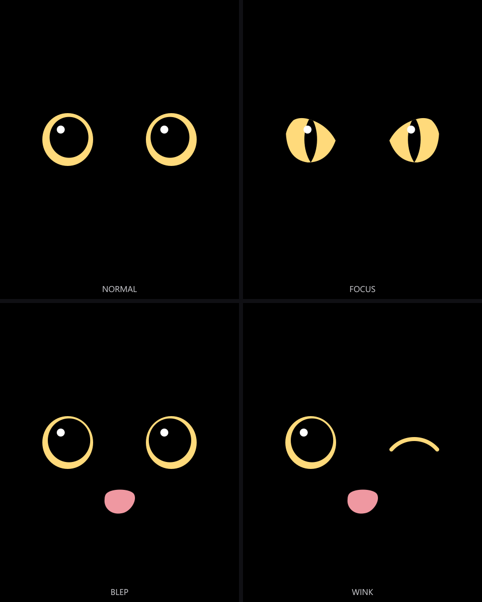
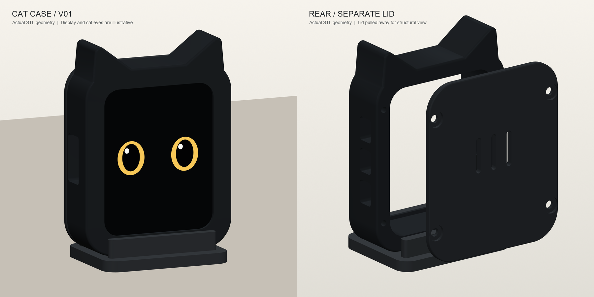

# ESP32 Cat DeskPet · 小猫桌宠

基于 **Waveshare ESP32-S3-Touch-LCD-1.69** 的实体触屏桌宠：黑猫动态眼睛、触摸与摇晃反馈、板上 WLAN 配网、网页留言接收，以及可选的电脑性能监控。

这是项目当前 **R22** 的公开源码快照，包含固件、留言网站、Windows 性能桥和独立设计的猫咪外壳 V01。固件版本字符串为 `deskpet-v01-20260929-r22-touch-finite`。本仓库不是微雪官方固件，也不是量产产品。



上图是黑猫 V06 的静态设计预览；实际固件通过参数化绘制生成动画，不依赖逐帧播放这张图片，也不运行 Flash/SWF。

## 现在可以做什么

- **三种角色**：黑白表情、贤者、黑猫，在屏幕菜单中切换并保存选择。
- **黑猫动画**：眨眼时眼睛轮廓变化、看向不同方向、圆瞳/竖瞳、移动高光、眯眼和吐舌等状态。
- **触摸互动**：轻点、抚摸、拖动，长按不移动约 2 秒进入睡觉表情，再点唤醒。睡觉是动画状态，不是低功耗休眠。
- **姿态互动**：倾斜影响位置；有节奏的手持摇晃触发眩晕、撞边与逐渐减速，避免普通轻微倾斜就触发。
- **屏幕菜单与 WLAN**：可见菜单按钮与顶部下滑入口；在板上扫描热点、用九键输入密码、连接、管理和清除保存的网络。
- **网页留言**：在自建网站登录、配对设备、写留言。服务器先渲染成 240×280 卡片，设备联网轮询获取，自动弹出并持续显示到轻点返回，减轻板上文字排版负担。
- **电脑性能**：安装可选 Windows 程序后，通过 USB 串口显示 CPU、内存及可获取的 GPU 数据。不支持的传感器显示未知，不伪造为零。

桌宠动画本身不需要电脑后台程序，也不需要 LLM。**电脑性能监控需要运行电脑端程序**，不是仅插 USB 就能读取 Windows 硬件传感器。网页留言需要自行部署服务、配置域名并完成配对。

## 硬件与适配范围

当前针对带触摸的 **ESP32-S3-Touch-LCD-1.69**，显示分辨率 **240×280**，ESP32-S3、16 MB Flash、8 MB PSRAM。不等同于不带触摸的 LCD 版或其他外观相似的 1.69 英寸开发板。

第一版只需开发板和支持数据传输的 USB-C 线。不要求额外传感器、扬声器或电池。

| 功能 | 当前引脚 |
| --- | --- |
| LCD SPI | DC 4 / CS 5 / SCK 6 / MOSI 7 / RST 8 / BL 15 |
| I²C | SDA 11 / SCL 10 |
| 触摸 | RST 13 / INT 14，地址 0x15 |
| 系统供电保持 | GPIO 41 |

以实际板卡版本和[官方文档](https://docs.waveshare.com/ESP32-S3-Touch-LCD-1.69)为准，其他版本不要直接套用。

## 目录

```text
sketch/DeskPetV01/       Arduino 固件与内嵌动画资源
tools/                  构建、离线测试与可选 PC 性能桥
server/                 Flask 留言网站、卡片渲染及测试
assets/black-cat-v06/    当前黑猫风格设计预览（非编译依赖）
enclosure/cat-case-v01/ 可打印 STL、可编辑 STEP、CAD 源码与说明
```

## 构建固件

需要 Arduino CLI、Git、PowerShell，以及 **Arduino-ESP32 3.3.11**。已有环境可直接复用；构建脚本不自动烧录、不接触串口。

```powershell
git clone https://github.com/Bandwe/esp32-cat-deskpet.git
cd esp32-cat-deskpet

arduino-cli core update-index --additional-urls https://espressif.github.io/arduino-esp32/package_esp32_index.json
arduino-cli core install esp32:esp32@3.3.11 --additional-urls https://espressif.github.io/arduino-esp32/package_esp32_index.json

powershell -ExecutionPolicy Bypass -File tools/fetch_dependencies.ps1
powershell -ExecutionPolicy Bypass -File tools/build_pet.ps1
```

依赖锁定为 Waveshare 仓库提交 `25fed2f7e8411f2522448b58906774db99a14a08` 中的 GFX 1.6.5 和 SensorLib 0.4.1。详见 [工具说明](tools/README.md)。Arduino CLI 不在 PATH 时，可传 `-ArduinoCli`；使用自己的 CLI 配置时可传 `-ConfigFile`。

板卡选项：

```text
esp32:esp32:esp32s3:FlashSize=16M,FlashMode=qio,PSRAM=opi,USBMode=hwcdc,CDCOnBoot=default,PartitionScheme=app3M_fat9M_16MB
```

构建产物输出至 `firmware/`，不进入 Git。烧录前请核对实物型号、USB 端口、分区方案和已有数据，按官方烧录流程操作。仓库不包含作者实物专用烧录脚本、工厂备份或读回的 Flash/NVS 镜像。

### 配置自己的留言服务

公开版默认服务名为占位符 `esp.example.com`，**不会使用项目作者的线上网站或凭据**。仅运行本地桌宠动画可以暂不配置它。

1. 按 [server/README.md](server/README.md) 部署自己的 HTTPS 网站。
2. 复制 `sketch/DeskPetV01/DeskPetConfig.example.h` 为同目录的 `DeskPetConfig.local.h`。
3. 将 `DESKPET_MESSAGE_HOST` 改为自己的域名，只写主机名，不带 `https://`、端口或路径，然后重新构建固件。
4. 在板上进入 WLAN 设置连接 **2.4 GHz** 网络，在网站生成配对码并在板上输入。之后留言可跨网络接收，双方不必在同一个局域网。

本地配置文件已经被 Git 忽略。Wi-Fi 密码和设备令牌通过运行时设置保存在板上，不应写进公开源代码。固件内置信任 ISRG Root X1；服务证书须能建立到受信任根的链，换用其他 CA 时应更新受信任根，而不是关闭 TLS 校验。

### 可选：电脑性能显示

见 [PC 性能桥说明](tools/pc-monitor.md)。需要安装 Python 依赖，显式指定设备 USB 序列号，并通过固件版本握手。无需此功能时，不必运行桥接程序。

## 猫咪外壳 V01



尺寸约 **42.4 × 56.9 × 14.8 mm**。含前壳、可拆后盖及可选桌面底座；打印使用 `enclosure/cat-case-v01/print/` 中的三个 STL。

外壳已留存 CAD/网格技术检查报告，但**尚未实物打印试装，没有经过验证的电池仓**。预览中的屏幕与猫眼为示意。请先读 [打印与装配说明](enclosure/cat-case-v01/README_打印与装配.md)，不要将数字模型检查当成实物适配保证。

## 测试与已知边界

- 离线 C++ 测试覆盖手势、触摸拖动、眩晕判定、WLAN 输入/存储、卡片传输与协议等；PC 桥和网站有 Python 单元测试。入口见各目录说明。
- 贤者资源的原始帧逐字节比对需要仓库外的原始素材，因此不是普通 clone 后默认测试的一部分；固件内嵌的压缩帧可直接编译。
- 本次公开版整理仅配置化部署信息，未重新烧录用户正在使用的板子，也未改动线上服务。
- 不提供经过验证的内置电池方案、电量显示、低电量保护、低功耗策略或飞行/磁悬浮功能。
- 这是个人原型，性能、接口与硬件版本仍可能需要按实际设备调整。

## 公开范围与许可

本仓库有意不包含个人密码、密钥、真实设备序列号、线上部署连接资料、运行数据库、串口日志、整机备份、历史固件或本机虚拟环境。

**公开可见不等于已授予统一的开源许可。** 项目自有代码与素材暂未选定统一许可证；第三方组件沿用各自许可证，见 [THIRD_PARTY_NOTICES.md](THIRD_PARTY_NOTICES.md)。安全与隐私注意事项见 [SECURITY.md](SECURITY.md)。
